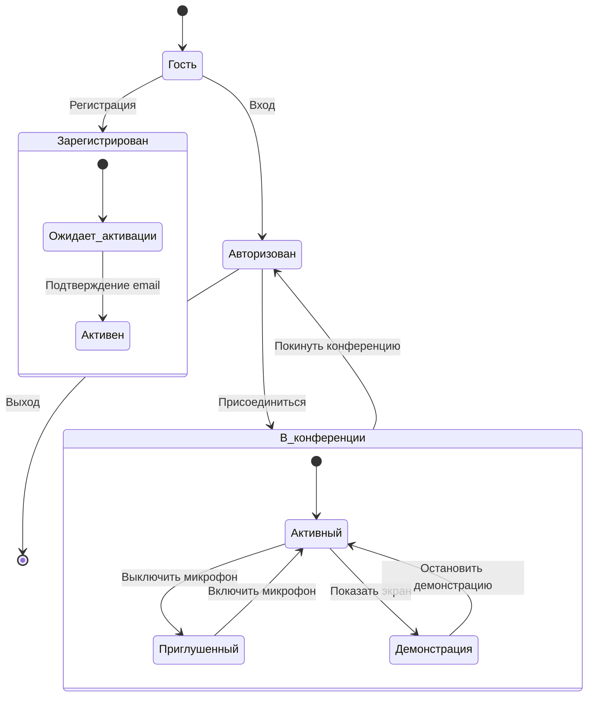
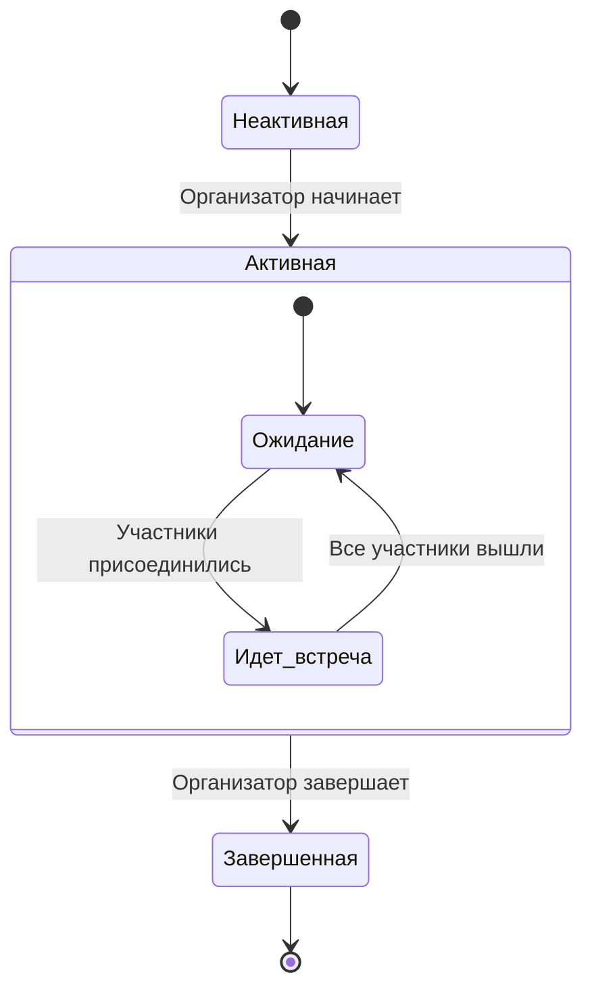
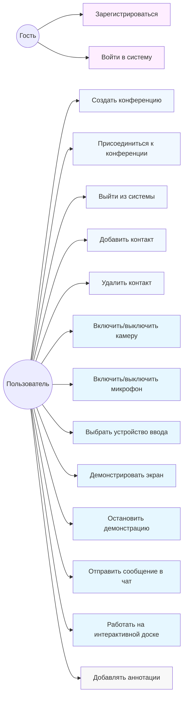
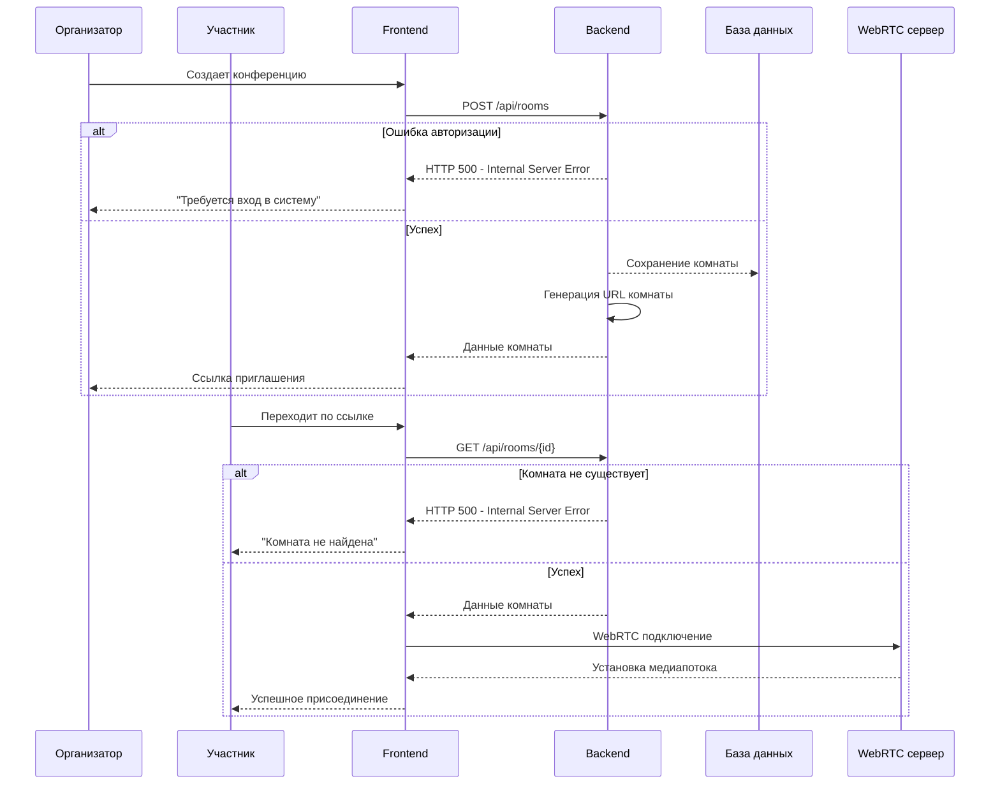
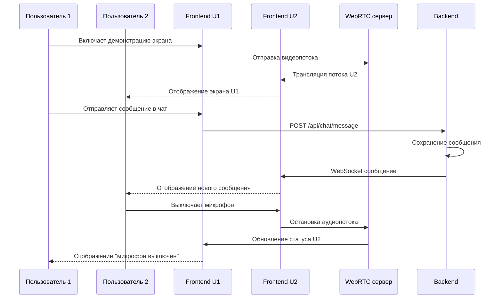
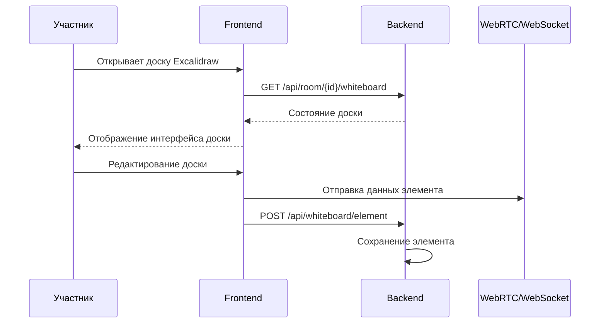
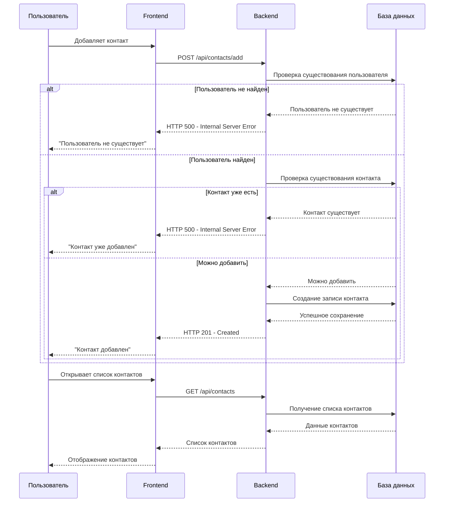

## Диаграммы состояний (State Diagram)

###### 1. Состояние пользователя

##### 2. Состояние конференции

## Use Case диаграммы 
  
#### Основные возможности

## Диаграммы последовательностей (Sequence Diagrams)

##### 1. Создание и проведение конференции

##### 2. Взаимодействие в конференции

##### 3. Работа с интерактивной доской

##### 4. Добавление  пользователя в контакты

